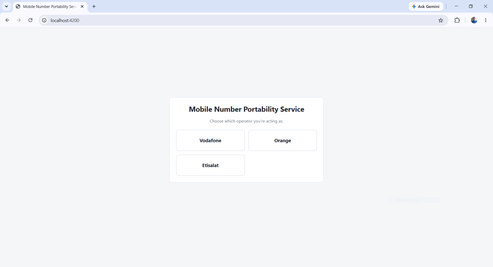
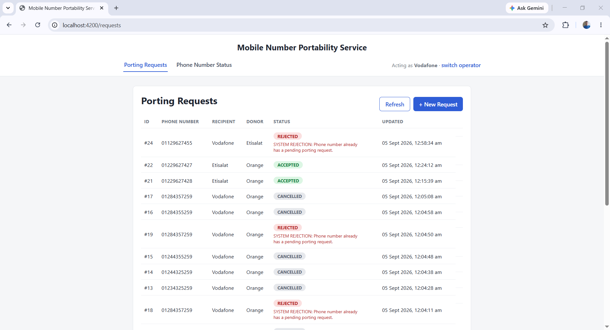
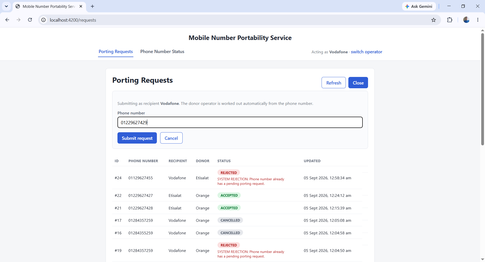
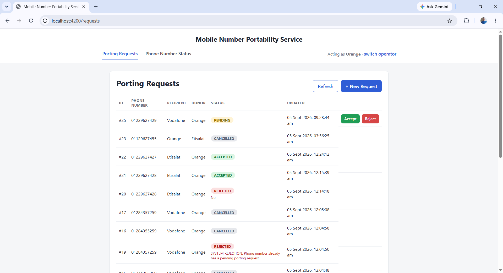
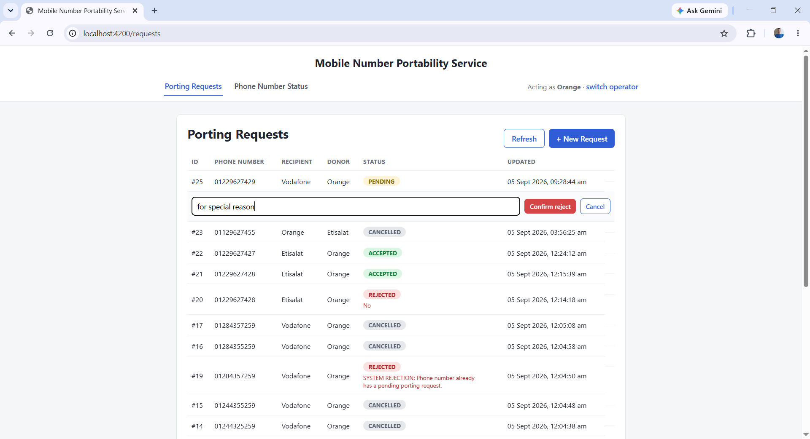
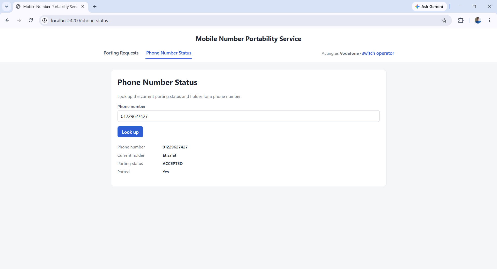
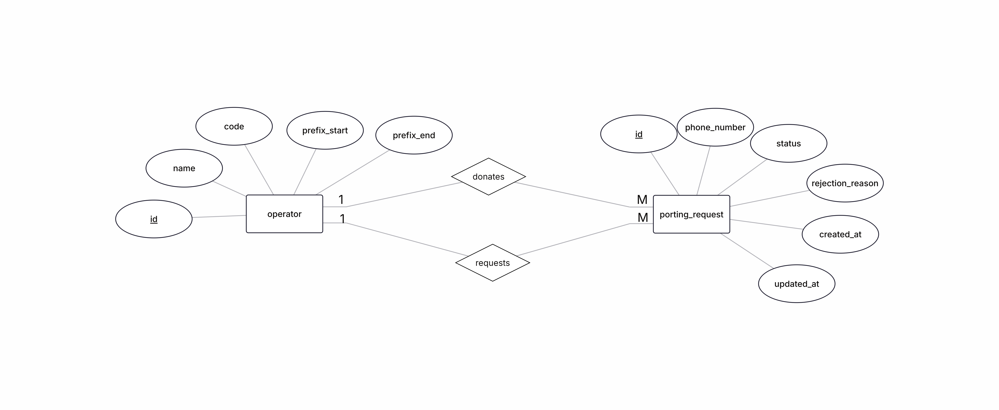

# MNP Service — Mobile Number Portability System

## Description

MNP Service simulates a Mobile Number Portability (MNP) workflow between telecom operators. An operator can request to "port" a phone number away from whichever operator currently holds it (the donor); the donor then accepts or rejects the request. Pending requests that sit too long are auto-cancelled by a background job, and anyone can look up who currently holds a given number.

The project has two parts:
- **`mnp-backend`** — Spring Boot REST API (business rules, validation, persistence).
- **`mnp-frontend`** — Angular SPA that consumes the API.

Both run together via Docker Compose, alongside MySQL.

---

## Screenshots

### Operator selection screen


### Porting requests list


### Create Porting Request


### Accept Porting Request


### Accept Porting Request


### Phone number status lookup


---

## Technologies Used

Spring Boot 4.1.1 (Java 17), Spring Data JPA, Spring Security, Spring Validation, MySQL 8.0 — on the backend. Angular 20 (standalone components) with TypeScript 5.8 on the frontend, served in production by Nginx. Docker & Docker Compose tie both together.

---

## Database

### Entity Relationship Diagram



Two tables: **`operators`** and **`porting_requests`**. A porting request links to `operators` twice — once as the **recipient** (`recipient_operator_id`, relationship `REQUESTS`) and once as the **donor** (`donor_operator_id`, relationship `DONATES`) — both one-to-many from the operator's side.

### Tables

**`operators`**: `id` (PK), `name`, `code` (used in the `organization` header), `prefix_start`, `prefix_end`.

**`porting_requests`**: `id` (PK), `phone_number`, `status` (`PENDING` / `ACCEPTED` / `REJECTED` / `CANCELLED`), `rejection_reason`, `created_at`, `updated_at`, `recipient_operator_id` (FK), `donor_operator_id` (FK).

---

## API Endpoints

All endpoints are prefixed with `/api`. Every endpoint except `GET /api/operators` requires an `organization` header (an operator's `code`) to identify the caller.

| Method & Path | Purpose |
|---|---|
| `GET /api/operators` | List all operators. No auth header required. |
| `POST /api/porting-requests` | Create a porting request for a phone number; caller becomes the recipient, donor is resolved automatically. |
| `GET /api/porting-requests` | List requests involving the caller (as recipient or donor), plus all `ACCEPTED` requests. |
| `PATCH /api/porting-requests/{id}/decision` | Donor accepts or rejects a pending request (`action`, optional `rejectionReason`). |
| `GET /api/phone-numbers/{phoneNumber}/status` | Look up who currently holds a number and whether it's ever been ported. |

See `MNP-Service-Documentation.docx` for full request/response shapes and error cases per endpoint.

---

## Validation

Phone numbers are validated by format (11 digits, starting with `01`), required fields are enforced (`@NotBlank`, `@Size`), and business rules are checked in the service layer — e.g. a request can't target the operator that already owns the number, duplicate pending requests are auto-rejected, and only `PENDING` requests can be decided. All validation failures return a consistent JSON error shape via a global exception handler.

---

## Security

Instead of user login, each request identifies itself via an `organization` header naming an operator's code. A filter resolves that header into an authenticated `Operator` principal before the request reaches any controller; missing or invalid headers are rejected with `401`. Authorization is then enforced per-action — e.g. only the donor of a request may accept or reject it (`403` otherwise). The API is stateless, CORS is locked to the frontend's origin, and CSRF is disabled (standard for a stateless JSON API).

---

## Running the Project with Docker

**Prerequisites:** Docker & Docker Compose, with ports `3307`, `8080`, and `4200` free.

From the repository root (where `docker-compose.yml` lives):

```bash
docker compose up --build
```
> **Note for whoever runs this:** on the very first build, Docker Desktop sometimes drops the
> connection partway through with an error like `error during connect: ... EOF` while creating a
> container. This is a one-time Docker Desktop/engine hiccup caused by building the frontend,
> backend, and pulling MySQL all at once right after the engine starts — it is **not** a problem
> with the project itself. If you hit it, avoid the heavy combined build by splitting it into two
> steps instead:
> ```bash
> docker compose build
> docker compose up
> ```

This builds and starts three containers — MySQL (seeded automatically from `schema.sql`), the Spring Boot backend (waits for MySQL to be healthy), and the Angular frontend (served by Nginx, which proxies `/api/*` to the backend).

- App: **http://localhost:4200**
- API: **http://localhost:8080/api/...**
- MySQL: **localhost:3307** (`springstudent` / `springstudent`, db `mnp_db`)

Run in the background with `docker compose up --build -d`, view logs with `docker compose logs -f <service>`, and stop with `docker compose down` (add `-v` to also wipe the database volume).

See `MNP-Service-Documentation.docx` for a full breakdown of each service, the Dockerfiles, and configuration notes.
